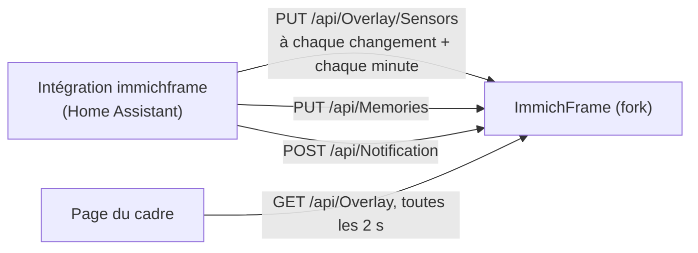

# Fork d'ImmichFrame

Série de patchs sur [immichFrame/ImmichFrame](https://github.com/immichFrame/ImmichFrame),
portée par la branche `patches`, rebasée sur chaque version amont. Elle remplace
l'ancienne surcouche en iframe du cadre photo (`frame-overlay` dans `cluster-config`).

Le cadre ne connaît pas Home Assistant : c'est l'intégration `immichframe` du
[fork de Home Assistant](https://github.com/spartan-dou/home-assistant-core) qui
l'appelle, comme un appareil ESPHome.



| Patch | Fichiers |
|---|---|
| Souvenirs : `GET`/`PUT /api/Memories` (`enabled`, `only`), **seule source de vérité** — `ShowMemories` est ignoré, l'état est gardé dans `$IMMICHFRAME_STATE_PATH/memories.json` (à défaut, le dossier de config). Masqués tant que l'API ne les a pas allumés, comme en amont. `only` : les souvenirs du jour seuls, et les photos habituelles un jour sans souvenir | `IMemoriesSwitch`, `MemoriesSwitch`, `ToggleableAssetPool`, `MemoriesOnlyAssetPool`, `MemoriesController` ; le constructeur de `PooledImmichFrameLogic` |
| Plusieurs comptes : un compte sans source (ni album, ni personne, ni tag, ni favoris) n'apporte que ses souvenirs, pas toute sa photothèque. `only` ne revient aux photos habituelles que si aucun compte n'a de souvenir ce jour-là | `TodaysMemories`, `MemoriesOnlyAssetPool` ; `BuildPool` et le constructeur de `PooledImmichFrameLogic` |
| Lots sans doublon : `MultiAssetPool` tire avec remise, la même photo sortait deux fois côte à côte en mode portrait | `DistinctAssetPool` |
| Souvenirs du bon jour : demandés pour midi de la date locale. Immich les range sur le jour UTC : demandés « maintenant » au minuit local, ceux de la veille revenaient et restaient en cache toute la journée | trois lignes dans `MemoryAssetsPool` |
| Valeurs sous l'heure : `PUT /api/Overlay/Sensors`, en mémoire. Sans nouvelle poussée depuis 5 min, les valeurs s'affichent « -- » plutôt que figées | `SensorStore`, `OverlayController` |
| Notifications : `POST`/`DELETE /api/Notification`, en mémoire. Trois au plus, la plus récente en haut ; un message déjà affiché remonte au lieu de prendre une deuxième place. `tag` facultatif, comme sur mobile : un nouveau message de même tag remplace l'ancien, un message vide avec un tag n'efface que celui-là | `NotificationController`, `NotificationStore` |
| Surcouche : heure et date à la place de l'horloge amont (mêmes formats), valeurs, notifications, tap qui rouvre Home Assistant. Cartes translucides floutées, dimensionnées sur le petit côté de l'écran ; la date et le lieu de la photo prennent le même style depuis ce composant, `asset-info.svelte` reste celui de l'amont | `home-assistant-overlay.svelte`, deux lignes dans `home-page.svelte` |
| Image | `.github/workflows/fork-image.yml` |

Le code amont n'est touché qu'en quatre endroits (`PooledImmichFrameLogic.cs`,
`MemoryAssetsPool.cs`, `Program.cs`, `home-page.svelte`) : ce sont les seuls conflits
possibles au rebase.

Les API sont protégées comme le reste d'ImmichFrame : par `AuthenticationSecret`
s'il est défini, ouvertes sinon.

## Monter de version

```bash
git fetch upstream --tags
git rebase --onto v<nouvelle> v<actuelle> patches
git push --force-with-lease origin patches
```

La CI teste, puis publie `ghcr.io/spartan-dou/immichframe:patches-<sha>`, à reporter
avec son digest dans `cluster-config`.
